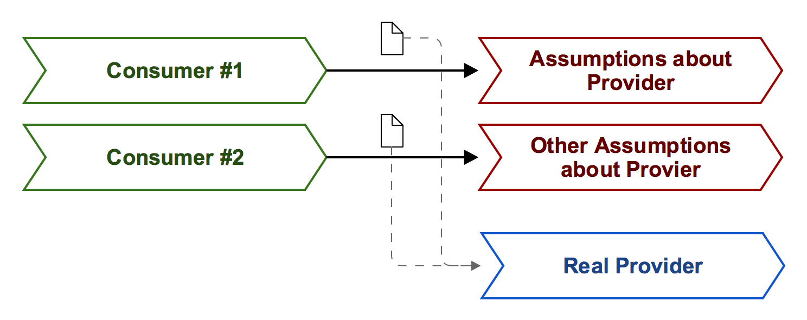

# Learning: Contract Testing (Consumer-driven or otherwise)

This repository conains information on how I learned contract testing. _(this is a work in progress)_

## Usefull Resources:

- Blogposts & Article
  - [Consumer Driven Contract Testing with PACT by Antoniya Atanasova](http://blog.novatec-gmbh.de/introduction-microservices-testing-consumer-driven-contract-testing-pact/)
  - [Consumer Driven Contracts with Spring Cloud Contract by Antoniya Atanasova](http://blog.novatec-gmbh.de/consumer-driven-contract-testing-spring-cloud-contract/)
- Documentation
  - [PACT](https://docs.pact.io)
  - [Spring Cloud Contract](http://cloud.spring.io/spring-cloud-contract/spring-cloud-contract.html)
- Additional Examples
  - [Showcase: JVM](https://github.com/slu-it/showcase-pact-jvm-consumer-jvm-provider)
  - [Showcase: JVM / JS](https://github.com/slu-it/showcase-pact-jvm-consumer-jvm-provider)

## From Integration to Contract Tests

### Integration Testing

### Service Simulation

### Contract Testing

